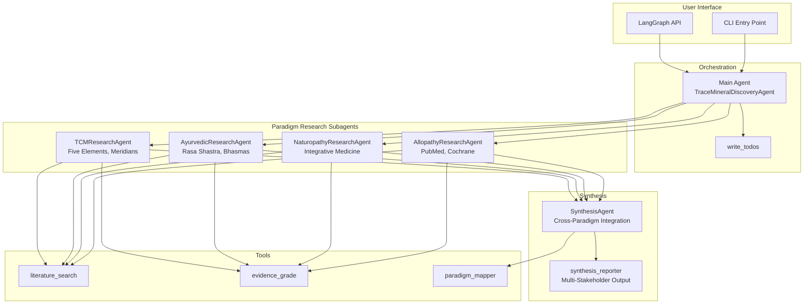
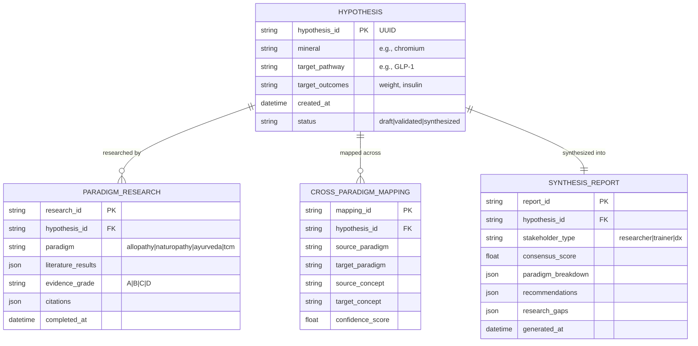

# Architecture

## Overview

TraceMineralDiscoveryAgent is a multi-agent system built on LangChain DeepAgents for cross-paradigm medical research synthesis.

## System Architecture



## Data Model



## Component Details

### Main Agent

The main TraceMineralDiscoveryAgent orchestrates the research workflow:

1. Receives user research query
2. Creates investigation plan
3. Dispatches to paradigm-specific subagents in parallel
4. Collects findings
5. Triggers synthesis

### Subagents

Each subagent has:

- **System Prompt**: Paradigm-specific research methodology
- **Tools**: Appropriate subset of available tools
- **Output Format**: Standardized markdown structure

#### Allopathy Research Agent

- Searches PubMed via E-utilities API
- Grades evidence using GRADE methodology
- Prioritizes RCTs and meta-analyses

#### Naturopathy Research Agent

- Searches integrative medicine databases
- Emphasizes food-first approaches
- Considers synergistic combinations

#### Ayurveda Research Agent

- Searches Ayurvedic literature and AYUSH databases
- Maps bhasma preparations to trace minerals
- Considers dosha theory and Agni

#### TCM Research Agent

- Searches TCM literature
- Maps Five Element correspondences
- Considers pattern diagnosis relevance

#### Synthesis Agent

- Integrates findings across paradigms
- Calculates consensus scores
- Generates stakeholder-specific reports

### Tools

#### literature_search

Routes to appropriate database based on paradigm:

- Allopathy → PubMed E-utilities
- Others → Tavily web search with domain filtering

#### evidence_grade

Implements adapted GRADE methodology:

- Paradigm-aware study type weighting
- Sample size, effect size, CI width assessment
- Peer review and replication bonuses

#### paradigm_mapper

Provides concept translations:

- Pre-defined mappings (85% confidence)
- Reverse mapping lookup
- Suggestions for unmapped concepts

#### synthesis_reporter

Generates three report types:

- **Research Scientist**: Full citations, methods, limitations
- **Product Trainer**: Talking points, positioning
- **DX Professional**: Clinical protocols, contraindications

## Deployment

### Local Development

```bash
# CLI mode
trace-mineral-agent

# LangGraph dev server
langgraph dev
```

### LangGraph Cloud

Configuration in `langgraph.json`:

```json
{
  "python_version": "3.11",
  "dependencies": ["./apps/agent"],
  "graphs": {
    "trace-mineral-discovery": "./apps/agent/src/trace_mineral_agent/agent.py:agent"
  }
}
```

## Security Considerations

- No hardcoded API keys
- Rate limiting for external APIs
- Input sanitization for search queries
- Medical disclaimer on all outputs

## Performance

- Parallel subagent execution for research queries
- Caching for repeated literature searches (planned)
- Streaming responses for long operations (planned)

## Testing Strategy

- Unit tests for tools and subagent configs
- Integration tests with mocked APIs
- End-to-end tests with LangSmith traces
